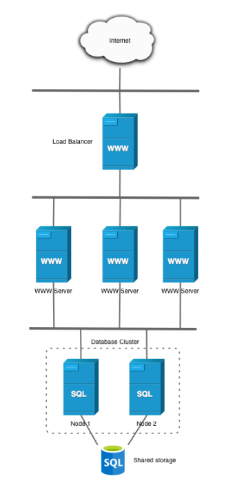
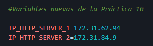
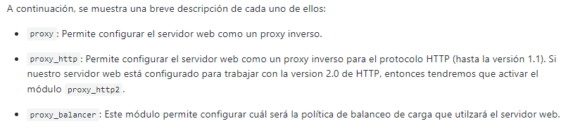
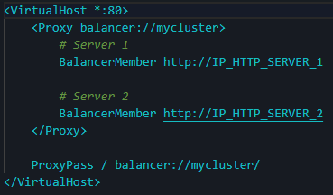
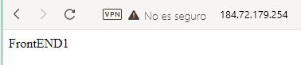
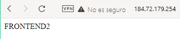

# Practica01-10IAW
Este repositorio es para la Práctica 1 apartado 10 de IAW

## ¿ Que tenemos que hacer en esta práctica?

- En esta práctica tenemos que crear un *_balanceador de carga_*, que es un hardware o software que se pone al frente de una serie de servidores y se encarga de balancear las peticiones que llegan a ambos servidores, de manera que pueda alternar entre uno y otro.

- El esquema que tendremos que seguir será el siguiente:

    

- Asi mismo tendremos que tener cuatro máquinas en funcionamiento que serán las siguientes:

    1. FrontEnd1
    2. BackEnd1
    3. FrontEnd2
    4. Sg Load Balancer (El balanceador)


## ¿ Que scripts tendremos que tener en nuestra práctica? 

- Tendremos que tener los siguientes pero como en la [Práctica 1-09IAW](https://github.com/kinoibanez/Practica01-9IAW) tenemos que tener mucho *_CUIDADO_* donde ejecutamos cada script, por que si no, haremos un lio entre las máquinas.


## Scripts *_Install_lamp_*

- Como hemos tenido anteriormente en prácticas, tenemos que tener dos scripts que se dediquen a instalar la pila LAMP con sus respectivas configuraciones tanto en el front como en el back.

- El primero que tenemos es el *_install_lamp_frontend_* que tendremos que ejecutar en ambas máquinas FRONT, cuidado con equivocarse.

    ```
    #!/bin/bash

    #Esto muestra todos los comandos que se van ejecutando
    set -x 
    #Actualizamos los repositorios
    apt update

    #Actualizamos los paquetes de la máquina 

    #apt upgrade -y

    # Instalamos el servidor web apache A.

    apt install apache2 -y

    # Instalamos PHP.

    sudo apt install php libapache2-mod-php php-mysql -y

    #Copiamos el directorio 000-default.conf (Archivo de configuración de apache2)

    cp ../conf/000-default.conf /etc/apache2/sites-available/000-default.conf

    # Instalamos PHP.

    sudo apt install php libapache2-mod-php php-mysql -y

    # Reiniciamos el servicio (apache)

    systemctl restart  apache2

    # Modificamos el propietario y el grupo del directorio /var/www/html

    chown -R www-data:www-data /var/www/html
    ```

    Instalamos apache2 como hemos hecho anteriormente y modificamos el usuario *www_data_* 


- El segundo que encontramos en el *_install_lamp_backend_* en el que como hemos hecho en otras prácticas instala `MySql Server` y modificamos las variables que tenemos en nuestro `.env` ya definidas.


    ```
    #!/bin/bash

    #Esto muestra todos los comandos que se van ejecutando
    set -x 
    #Actualizamos los repositorios
    apt update

    #Añadimos el source

    source .env

    #Actualizamos los paquetes de la máquina 

    #apt upgrade -y

    # Instalamos Mysql L.

    sudo apt install mysql-server -y

    #Configuramos MYSQL para que sólo acepte conexiones desde la IP privada

    sed -i "s/127.0.0.1/$MYSQL_PRIVATE_IP/" /etc/mysql/mysql.conf.d/mysqld.cnf


    #Creamos el usuario en MYSQL

    DROP USER IF EXISTS '$DB_USER'@'$FRONTEND_PRIVATE_IP';
    CREATE USER '$DB_USER'@'$FRONTEND_PRIVATE_IP' IDENTIFIED BY '$DB_PASS';
    GRANT ALL PRIVILEGES ON '$DB_NAME'.* TO '$DB_USER'@'$FRONTEND_PRIVATE_IP';

    #Reiniciamos el servicio de mysql

    systemctl restart mysql
    ```
### *_Install_lamp_* del Balanceador.

- Ahora es cuando entra la nueva configuración del nuevo script, este script tiene la función es modificar un archivo llamado *_load-balancer.conf_* que anteriormente tendremos que haber creado, para así poder indicar las dos IPS que tienen nuestros FRONT para poder redirigirte cada vez a uno cada vez que refresques la página. Es lioso, lo sé, pero podemos verlo de manera más simple a través del script.

    1. Nuestro archivo `.env` configurado con las IPS privadas de nuestro front end 1 y 2.

         
    
    2. En el script haremos uso de *_sed -i_* que como bien sabemos sirve para buscar una cadena y remplazarla por la variable $ que nosotros queramos. Acordarse de tener configurado el apartado anterior.

    3. Como paso siguiente tendremos que añadir una serie de módulos necesarios para configurar el balanceador como proxy inverso, que son los siguientes:

        ```
        sudo a2enmod proxy
        sudo a2enmod proxy_http
        sudo a2enmod proxy_balancer
        ```
    Que cada uno significa lo siguiente:

    

    4. El script completo que es el siguiente, aunque antes de poder lanzarlo también podemos lanzar otros módulos que encontramos en la [Práctica 1.10 de Jose Juan apartado 1.3](https://josejuansanchez.org/iaw/practica-01-10/index.html)

        ``` 
        #!/bin/bash

        #Esto muestra todos los comandos que se van ejecutando
        set -x 
        #Actualizamos los repositorios
        apt update

        #Actualizamos los paquetes de la máquina 


        #apt upgrade -y

        source  .env
        # Instalamos el servidor web apache A.

        apt install apache2 -y

        #Habilitamos los modulos necesarios para configurar apache como proxy inverso.

        sudo a2enmod proxy
        sudo a2enmod proxy_http
        sudo a2enmod proxy_balancer

        #Habilitamos el balanceo de carga Round Robin

        sudo a2enmod lbmethod_byrequests


        #copiamos el archivo de configuración 

        sudo cp ../conf/load-balancer.conf /etc/apache2/sites-available

        #Remplazamos los valores de la plantilla con la dirección IP de los frontales 

        sed -i "s/IP_HTTP_SERVER_1/$IP_HTTP_SERVER_1/" /etc/apache2/sites-available/load-balancer.conf
        sed -i "s/IP_HTTP_SERVER_2/$IP_HTTP_SERVER_2/" /etc/apache2/sites-available/load-balancer.conf

        #Habilitamos el virtualhost que hemos creado.

        sudo a2ensite load-balancer.conf 

        #Deshabilitamos el que tiene apache por defecto.

        sudo a2dissite 000-default.conf 

        #Reiniciamos el servicio

        sudo systemctl restart apache2

        ```

- Cada linea va comentada con la función que hace cada linea del código ;D.

    *_NOTA_*: Puede ser que lo lances y no funcione el balanceo... pero ¿Por qué?, esto se debe a que anteriormente hemos utilizado los front para otras prácticas, entonces el archivo *_index.html_* estará erroneo, por eso es recomendable hacer un `rm -rf` de ese archivo o borrar todo por completo haciendo `sudo nano` en cada uno de los front y directamente poner:

    ```
    Front End 1 Y Front End 2
    ```

    Si todo lo anterior se ha ejecutado correctamente, si accedemos a nuestro archivo *_load-balancer.conf_* tendra que estar de la siguiente con la IP privada de cada front.

    

### Scripts deploy.

- El *_deploy_backend_* como bien sabemos la principal configuración que tiene es borrar y volver a crear la base de datos cada vez que ejecutemos su script.


    ```

    #!/bin/bash

    #Esto muestra todos los comandos que se van ejecutando
    set -ex 
    #Actualizamos los repositorios
    apt update

    #Actualizamos los paquetes de la máquina 

    #apt upgrade -y

    #Incluimos las variables del archivo .env

    source .env
    # Creamos la base de datos y el usuario de base de datos.

    mysql -u root <<< "DROP DATABASE IF EXISTS $WORDPRESS_DB_NAME"
    mysql -u root <<< "CREATE DATABASE $WORDPRESS_DB_NAME"
    mysql -u root <<< "DROP USER IF EXISTS $WORDPRESS_DB_USER@$IP_CLIENTE_MYSQL"
    mysql -u root <<< "CREATE USER $WORDPRESS_DB_USER@$IP_CLIENTE_MYSQL IDENTIFIED BY '$WORDPRESS_DB_PASSWORD'"
    mysql -u root <<< "GRANT ALL PRIVILEGES ON $WORDPRESS_DB_NAME.* TO $WORDPRESS_DB_USER@$IP_CLIENTE_MYSQL"
    ```

    Pero estos scripts ya lo hemos usado en prácticas anteriores que encontramos en mi misma página de GitHub.


- El segundo script que tenemos que lanzar es el que hemos utilizado en prácticas anteriores es el *_deploy_frontend_*, este script deberemos lanzarlo en los dos FrontEnd que tenemos, de manera que dos tengan instalado apache y sus correspondientes pluggins.

    ```
    #!/bin/bash

    #Esto muestra todos los comandos que se van ejecutando
    set -ex 
    #Actualizamos los repositorios
    apt update

    #Actualizamos los paquetes de la máquina 

    #apt upgrade -y

    #Incluimos las variables del archivo .env

    source .env

    #Eliminamos instalaciones previas 

    rm -rf /tmp/wp-cli.phar

    # Descargamos la utilidad de wp-cli

    wget https://raw.githubusercontent.com/wp-cli/builds/gh-pages/phar/wp-cli.phar -P /tmp

    #Le asignamos permisos de ejecución al archivo wp-cli.phar

    chmod +x /tmp/wp-cli.phar

    #Movemos el archivo al directorio /usr/local/bin que almacena el listado de comandos del sistema.

    mv /tmp/wp-cli.phar /usr/local/bin/wp #wp es renombrado


    #Eliminamos instalaciones previas de wordpress

    rm -rf /var/www/html/*

    #Descargamos el codigo fuente de wordpress en /var/wwW/html

    wp core download --locale=es_ES --path=/var/www/html --allow-root

    #Crear el archivo .config, podemos comprobar haciendo un cat cat /var/www/html/wp-config.php si estan bien las variables

    wp config create \
    --dbname=$WORDPRESS_DB_NAME \
    --dbuser=$WORDPRESS_DB_USER \
    --dbpass=$WORDPRESS_DB_PASSWORD \
    --dbhost=$WORDPRESS_DB_HOST \
    --path=/var/www/html \
    --allow-root


    #Instalamos el directorio WORDPRESS con las variables de configuración en .env

    wp core install \
    --url=$CERTIFICATE_DOMAIN \
    --title="$WORDPRESS_TITLE"\
    --admin_user=$WORDPRESS_ADMIN_USER \
    --admin_password=$WORDPRESS_ADMIN_PASS \
    --admin_email=$WORDPRESS_ADMIN_EMAIL \
    --path=/var/www/html \
    --allow-root

    #Copiamos el archivo .htaccess

    cp ../htaccess/.htaccess /var/www/html/


    # Descargamos un plugin para la seguridad de WordPress

    sudo wp plugin install wp-staging --activate --path=/var/www/html --allow-root


    #Descargamos un tema cualquiera para la configuración

    #sudo wp  theme install Hestia --activate list --path=/var/www/html --allow-root

    #Descargamos un pluggin cualquiera.

    wp plugin install bbpress --activate --path=/var/www/html --allow-root

    #Links

    wp plugin install wps-hide-login --activate --path=/var/www/html --allow-root


    #Modificar nombres

    wp option update whl_page "NotFound" --path=/var/www/html --allow-root

    #Coniguramos el nombre de la entrada 

    wp rewrite structure '/%postname%/' --path=/var/www/html --allow-root

    #Modificamos los permisos de /var/www/html

    chown -R www-data:www-data /var/www/html
    ```

    Como podemos observar cada linea de código va comentada, en este script estamos lanzando WordPress con su respectiva configuración como pueden ser plugins, temas, etc... e incluso en el apartado final estamos cambiando la *URL* para que el acceso a través de *_wp-admin_* sea secreto solo para nosotros.


### Script *_setup_lestencrypt_certificate_*.

- Como  en prácticas anteriores la funciolidad de este script es para poder instalar la herramienta `cerbot`

    ```

    #!/bin/bash

    #Esto muestra todos los comandos que se van ejecutando
    set -ex 
    #Actualizamos los repositorios
    apt update

    #Actualizamos los paquetes de la máquina 

    #apt upgrade -y

    #Importamos el archivo de variables .env

    source .env

    #Instalamos y Actualizamos snapd.

    snap install core
    snap refresh core

    # Eliminamos cualquier instalación previa de certobot con apt.

    apt remove certbot

    # Instalamos el cliente de Certbot con snapd.

    snap install --classic certbot

    # Creamos un alias para la aplicación cerbot.

    sudo ln -sf /snap/bin/certbot /usr/bin/certbot

    # Obtenemos el certificado y configuramos el servidor web Apache.

    #sudo certbot --apache

    #Ejecutamos el comando certbot.
    certbot --apache -m $CERTIFICATE_EMAIL --agree-tos --no-eff-email -d $CERTIFICATE_DOMAIN --non-interactive


    #Con el siguiente comando podemos comprobar que hay un temporizador en el sistema encargado de realizar la renovación de los certificados de manera automática.

    #systemctl list-timers
    ```

### Final de la práctica y comprobamos que funciona.

- Si todo lo anterior se ha configurado de manera correcta, si accedemos a nuestro nombre del dominio o la ip pública del balanceador nos saldrá lo que tengamos escrito dentro de nuestro archivo index.html

1. Con el balanceado al front end 1.

    

2. Con el balanceado al front end 2.

    


#### Apuntes varios

- Como sabemos en prácticas anteriores tenemos que modificar la ip a través de [No-IP](https://www.noip.com/es-MX)

- Para comprobar errores de apache ya sabemos que es en `/var/log/apache2`

- Directorio de apache `var/www/html`

- Algo que no se ha comentado pero tenemos que tener también es nuestro archivo `.htaccess` que tendrá que tener la siguiente estructura.

    ```
    # BEGIN WordPress
    <IfModule mod_rewrite.c>
    RewriteEngine On
    RewriteBase /
    RewriteRule ^index\.php$ - [L]
    RewriteCond %{REQUEST_FILENAME} !-f
    RewriteCond %{REQUEST_FILENAME} !-d
    RewriteRule . /index.php [L]
    </IfModule>
    # END WordPress

    ```